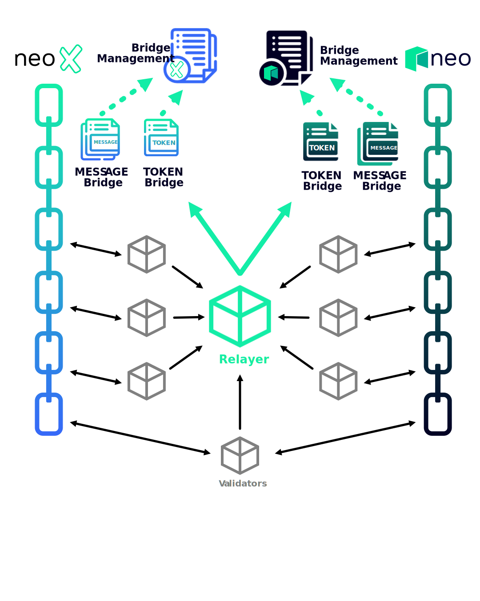

# Architecture

The bridge is composed of the following key components:

* Smart Contract for Role Management and Verifying Validator Consensus (BridgeManagement)
* Smart Contract for Transferring Assets (TokenBridge)
* Smart Contract for Bridging Messages (MessageBridge)
* Validator Nodes
* One Relayer Node

> Each of the above listed contracts is deployed once per chain.

The smart contracts serve as the foundation for the bridging system. They contain crucial functionality such as role management (BridgeManagement), accepting token transfer requests including locking and unlocking them (BridgeContract) and message sending (MessageBridge).

The validator nodes track incoming bridge requests, validate and sign them off, and then provide the observed request data including their signature to the relayer.

The relayer is a single node that awaits and collects signatures and bridge request data from validator nodes. Once enough signatures have been collected for passing verification on the destination chain's BridgeManagement, it invokes the corresponding bridge contract to finalize the bridge request. Depending on the type and data of the request, the sent message is persisted, or tokens are distributed or are made available for claiming.

The architecture of the bridge is illustrated in the following image:

<figure><figcaption></figcaption></figure>
