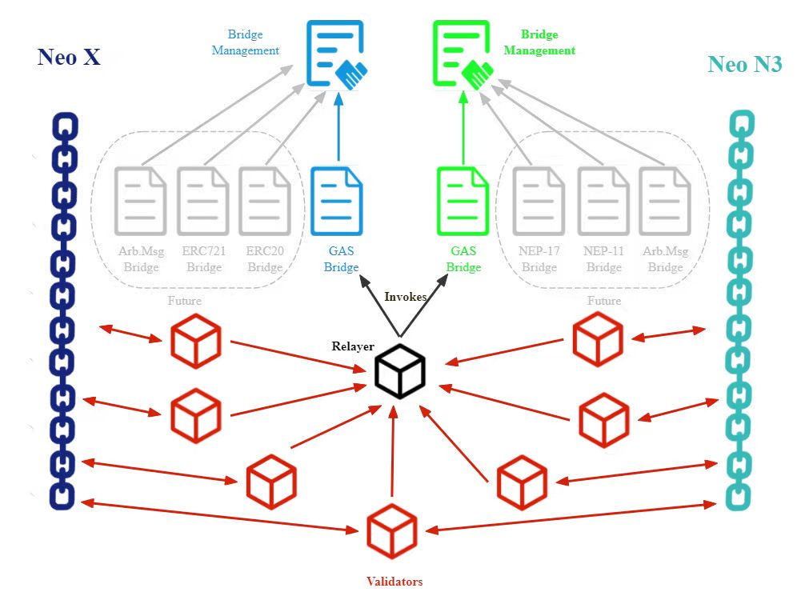

# Architecture

The bridge is composed of the following key components:

* Smart contracts deployed on N3 and Neo X: These smart contracts serve as the foundation for the bridging system, containing crucial functionalities such as the ability to lock, and unlock tokens. Additionally, they also maintain and verify the Hash Chains.
* Bridge validators:  These nodes listen for events emitted by the bridge contracts. Upon detecting an event, they validate it, sign it, and send the signature and event details to the relayer.&#x20;
* A relayer: This single node collects signatures from the validators. Once enough signatures are collected for a bridging transaction, it invokes the corresponding bridge contract to mint or unlock tokens.

The architecture of the bridge is illustrated in the following image:

<figure><figcaption></figcaption></figure>

## Roles

The Neo N3->Neo X bridge involves distinct roles:

* Owner
* Validator
* Relayer
* Security Council (Governor and SecurityGuard)

These roles are set in a separate management smart contract deployed on both N3 and Neo X.

Validators are nodes that listen for events emitted by the bridge contracts, create signatures, and forward them to the relayer. The relayer, a single node with load-balancing capabilities, is responsible for collecting these signatures from validators, verifying them, and invoking the corresponding function on the destination chain. The owner, a multi-signature account consisting of keys stored in cold wallets, is responsible for changing the relayer and validator multi-signature accounts and resetting roots of the hash chain if necessary.

The table below provides an overview of the main functionalities of the smart contracts and who is allowed to use them.

<table>
    <thead>
        <tr>
            <th width="220">Functionality</th>
            <th width="230">BridgeManagement</th>
            <th width="150">Neo N3 Bridge</th>
            <th width="150">Neo X Bridge</th>
        </tr>
    </thead>
    <tbody>
        <tr>
            <td>Update Contract</td>
            <td>Owner (Council on Neo X)</td>
            <td>Owner</td>
            <td>Council</td>
        </tr>
        <tr>
            <td>Assign Roles</td>
            <td>Owner</td>
            <td>-</td>
            <td>-</td>
        </tr>
        <tr>
            <td>Deposit GAS/tokens</td>
            <td>-</td>
            <td>Anyone</td>
            <td>-</td>
        </tr>
        <tr>
            <td>Withdraw GAS/tokens</td>
            <td>-</td>
            <td>Relayer</td>
            <td>-</td>
        </tr>
        <tr>
            <td>Distribute GAS/tokens</td>
            <td>-</td>
            <td>-</td>
            <td>Relayer</td>
        </tr>
        <tr>
            <td>Pause</td>
            <td>-</td>
            <td>SecurityGuard</td>
            <td>SecurityGuard</td>
        </tr>
        <tr>
            <td>Unpause</td>
            <td>-</td>
            <td>Governor</td>
            <td>Governor</td>
        </tr>
    </tbody>
</table>

> **IMPORTANT:**
>
> Although only the relayer is authorized to use the distribution functions, it requires the signatures of the validator multi-signature accounts.

> The pause functionality can be included to discontinue accepting deposits, for instance, when a bridge smart contract requires an update.

## Smart Contracts

The bridge smart contracts are tasked with accepting deposits and withdrawals, as well as computing and validating the Merkle Tree based on permissions.

The structure of the smart contracts involved is largely comparable on both the N3 and Neo X chains. Each chain has a BridgeManagement contract that serves to define which accounts occupy particular roles. The bridge contracts contain the logic for accepting deposits and burns, and for verifying mints and withdrawals based on the designated role of the account that initiates the transaction. Both N3 and NeoX contracts also incorporate an update functionality.

### **Bridge Management Contracts**

**Chain:** N3 and Neo X&#x20;

**Purpose:** Manage roles&#x20;

**Functionalities:**

* Get relayer address
* Get validators (or check if address is a validator)
* Verify validator signatures
* Update owner
* Update relayer
* Update validators (incl. threshold)
* Update governor
* Update securityGuard
* Update contract

### **Bridge Contracts**

**Chain:** N3 and Neo X&#x20;

**Purpose:** Bridge GAS tokens between Neo N3 and Neo X.&#x20;

**Functionalities:**

* Deposit/Withdraw GAS tokens
* Pause/Unpause bridge
* Update configuration of bridges (e.g., max/min deposit/withdraw amount, and fee)
* Claim tokens (if the recipient is a contract or if the transfer on the target chain fails)

## Relayer and Validator

In this phase, the Relayer has a centralized and simplistic approach -- listens to events, validates deposit events, and invokes smart contracts on the destination chain.

However, even though the Relayer software is running on a single node, signatures must be requested from isolated/protected entities operating in a secure environment.

Therefore, the software architecture for the Relayer should be:

* **Validator Backend**
  * Listens to smart contract events
  * Validates deposit events
  * Signs the data based on a locally loaded keypair
  * Forwards to the relayers part of a message broker (within the same network)
* **Relayer Backend**
  * Listen to messages (message broker), from Validator backend
  * If a minimum of `n` messages arrive
    * (Verify validators' deposit/withdraw data (and the root) with on-chain event data)
    * Validates the signatures using the deposit/withdraw data and new root
  * Build a transaction with the respective data and signs it
  * Invokes the bridge smart contract (sends the transaction)

## Infrastructure

**Computation Infrastructure:**

* 1 router (can also be a virtual router)
* 1 message broker (e.g., zeromq), on-premise
* 2 machines to run the Relayer backend (4Gb, 2 CPUs) \[Relayer Nodes] \[Failover]
* 7 machines to run the Validator backend (ech with min. 1Gb, 1 CPU) \[Validator Nodes]

**Network Infrastructure:**

* 1 VLAN, internal network (Relayer Nodes + Validator Nodes)
* Private IPs
* "Deny All" firewall rules from external traffic coming to the VLAN
