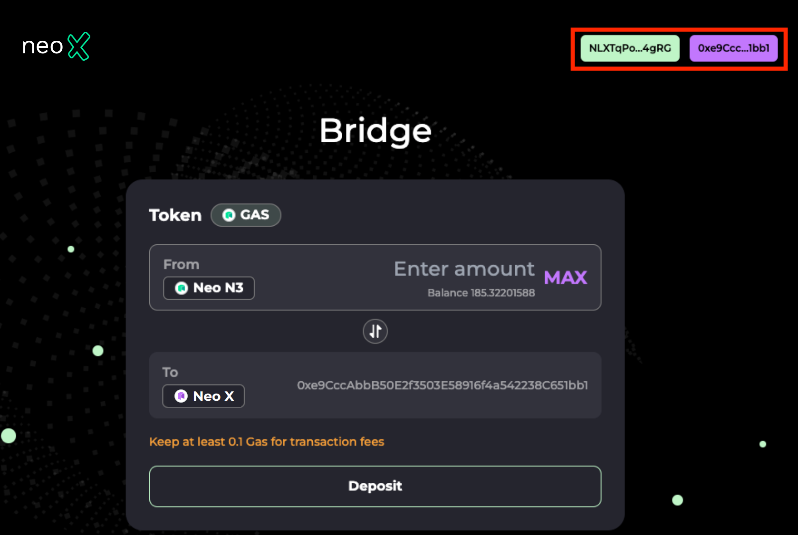

# Quick Start: Bridging Assets

This guide helps users quickly move GAS or any NEP-11 tokens from Neo N3 to Neo X, or vice versa, using the [Neo X bridge](https://t3bridge.banelabs.org/).

We will walk you through the entire process, explaining each step in depth. If you get stuck at any point, feel free to reach out to us on [Discord](https://discord.gg/neosmarteconomy) for assistance.

## Prerequisites

To get started quickly, you need to have:

* A web3 wallet installed, such as [Neoline](https://neoline.io/en/) or [Metamask](https://metamask.io/download/). If you don't have one, visit the link to download.
* Some GAS on Neo N3. There are several ways to acquire _GAS_ :
  * Use a supported centralized exchange like Binance or OKX, which allows you to buy _GAS_ and withdraw it to your wallet. Most major centralized exchanges support direct withdrawal from your centralized exchange wallet to Neo N3   &#x20;
  * Request funds from a faucet for [Testnet N3T5](https://n3t5wish.ngd.network/#/), if you are using a testnet

## Depositing GAS (from Neo N3 to Neo X)

### **Step 1: Add the Neo X network to your Metamask**

You'll also need to add the Neo X's RPC endpoint to your wallet. Here we provide two ways for doing this using MetaMask.

* (Recommended) Click the button on the bottom-left of [Neo X's Explorer](https://xt3scan.ngd.network/) to automatically add Neo X to MetaMask   &#x20;

<figure><figcaption></figcaption></figure>

*   On your browser, click on the MetaMask extension.

    1. Click the network selector drop-down on the top-left corner, and then click `Add Network`.
    2. Click `Add a network manually` and then provide the information corresponding to the chain you want to send your assets to.

    

    <figure><figcaption></figcaption></figure>

    

The information about Neo X is listed as below:

<table><thead><tr><th width="212">Parameter</th><th width="170">Neo X Mainnet</th><th>Neo X Testnet</th></tr></thead><tbody><tr><td>Network name</td><td>Neo X</td><td>Neo X Testnet</td></tr><tr><td>RPC URL</td><td></td><td><a href="https://neoxseed1.ngd.network">https://neoxseed1.ngd.network</a></td></tr><tr><td>Chain ID</td><td></td><td>12227331</td></tr><tr><td>Currency symbol</td><td>GAS</td><td>GAS</td></tr><tr><td>Block explorer URL</td><td></td><td><a href="https://xt3scan.ngd.network/">https://xt3scan.ngd.network</a></td></tr></tbody></table>

### **Step 2: Initiate the deposit**

1. Go to [https://t3bridge.banelabs.org](https://t3bridge.banelabs.org/).
2.  Log in to the bridge with your wallet. Check that you're connected to Neo N3 and Neo X on the page for asset deposits.

    > Note: Neo X TestNet currently only supports the bridging of _GAS_ .

    <figure><figcaption></figcaption></figure>
3.  Enter the amount of _GAS_ you want to bridge over in the `From` box and then press `Deposit`. Follow the prompts on your Neo N3 wallet. You can also click `MAX` to deposit all _GAS_ to Neo X.

    > **ENSURE SUFFICIENT GAS BALANCE** It is important to have enough GAS in your wallet to complete the transaction, or else the web3 wallet will not pop-up. When you click `MAX`, GAS for transaction fee will be remained.

    <figure><figcaption></figcaption></figure>

It usually takes around 1-2 minutes (varying based on the chain congestion) for funds to transfer to Neo X after submitting the transaction from your Neo N3 wallet.

## Withdrawing _GAS_ (from Neo X to Neo N3)

1.  Log in to [https://t3bridge.banelabs.org](https://t3bridge.banelabs.org) with your wallet. Check that you are connected to the source network (e.g., Neo X) and the destination network (e.g., Neo N3) shown at the top of the page.      &#x20;

    <figure><figcaption></figcaption></figure>
2.  Enter the amount of _GAS_ you want to bridge over in the `From` box and then press `Withdraw`. Follow the prompts on your web3 wallet.

    > **ENSURE SUFFICIENT GAS BALANCE** It is important to have enough GAS in your wallet to complete the transaction, or else the web3 wallet will not pop-up.

    <figure><figcaption></figcaption></figure>

It usually takes around 1-2 minutes (varying based on the chain congestion) for funds to transfer to Neo N3 after submitting the transaction from your Metamask.

\
