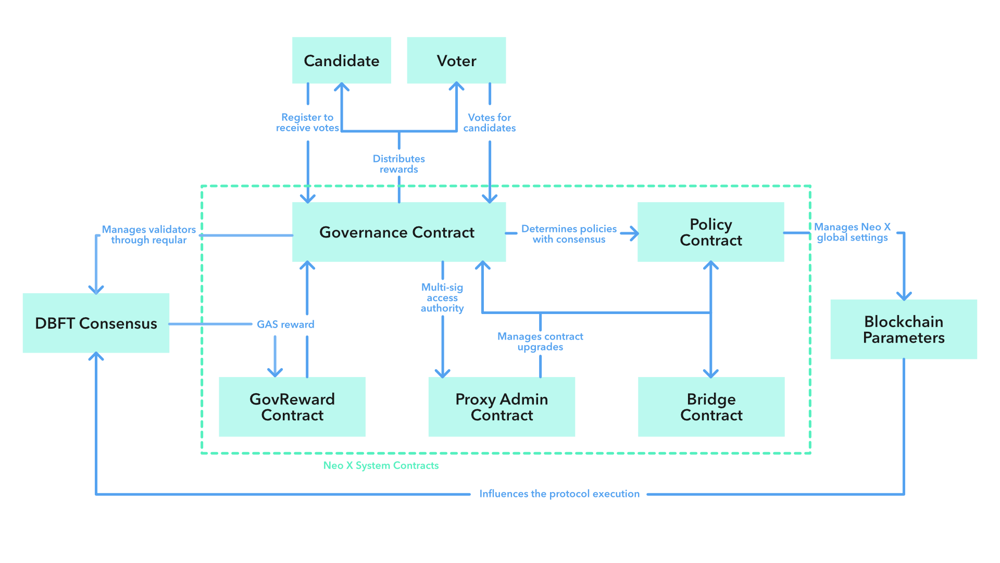
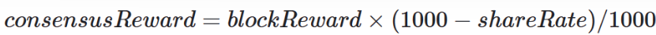
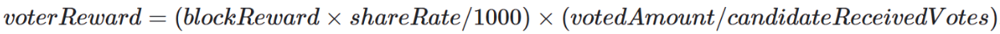

# Neo X System Contracts

Neo X system contracts are a set of build-in Solidity contracts with predefined addresses. They represent the governance and economic model of Neo X, which is fully decentralized and transparent.

<figure><figcaption></figcaption></figure>

These contracts are not deployed by transactions but allocated in the [genesis file](https://github.com/bane-labs/go-ethereum/blob/bane-main/config). The address setting of existing pre-compiled contracts is listed as below.

<table>
    <thead>
        <tr>
            <th width="450">Address</th>
            <th width="300">Contract</th>
        </tr>
    </thead>
    <tbody>
        <tr>
            <td>0x1212000000000000000000000000000000000000</td>
            <td>GovProxyAdmin</td>
        </tr>
        <tr>
            <td>0x1212000000000000000000000000000000000001</td>
            <td>Governance Proxy</td>
        </tr>
        <tr>
            <td>0x1212000000000000000000000000000000000002</td>
            <td>Policy Proxy</td>
        </tr>
        <tr>
            <td>0x1212000000000000000000000000000000000003</td>
            <td>GovernanceReward Proxy</td>
        </tr>
        <tr>
            <td>0x1212000000000000000000000000000000000004</td>
            <td>Bridge Proxy</td>
        </tr>
        <tr>
            <td>0x1212000000000000000000000000000000000005</td>
            <td>BridgeManagement Proxy</td>
        </tr>
        <tr>
            <td>0x1212000000000000000000000000000000000006</td>
            <td>Treasury</td>
        </tr>
        <tr>
            <td>0x1212000000000000000000000000000000000007</td>
            <td>CommitteeMultiSig Proxy</td>
        </tr>
        <tr>
            <td>0x1212000000000000000000000000000000000008</td>
            <td>KeyManagement Proxy</td>
        </tr>
        <tr>
            <td>0x1212000000000000000000000000000000000009</td>
            <td>Stub1 Proxy</td>
        </tr>
        <tr>
            <td>0x121200000000000000000000000000000000000a</td>
            <td>Stub2 Proxy</td>
        </tr>
        <tr>
            <td>0x121200000000000000000000000000000000000b</td>
            <td>Stub3 Proxy</td>
        </tr>
        <tr>
            <td>0x121200000000000000000000000000000000000c</td>
            <td>Stub4 Proxy</td>
        </tr>
        <tr>
            <td>0x121200000000000000000000000000000000000d</td>
            <td>Stub5 Proxy</td>
        </tr>
        <tr>
            <td>0x121200000000000000000000000000000000000e</td>
            <td>Stub6 Proxy</td>
        </tr>
        <tr>
            <td>0x121200000000000000000000000000000000000f</td>
            <td>Stub7 Proxy</td>
        </tr>
        <tr>
            <td>0x1212000000000000000000000000000000000010</td>
            <td>Stub8 Proxy</td>
        </tr>
        <tr>
            <td>0x1212000000000000000000000000000000000011</td>
            <td>Stub9 Proxy</td>
        </tr>
    </tbody>
</table>

## GovernanceVote

[GovernanceVote](https://github.com/bane-labs/go-ethereum/blob/bane-main/contracts/solidity/base/GovernanceVote.sol) is a public "library" that is widely used in system contract management especially upgrade.

Any contract inheriting `GovernanceVote.sol` can set up a consensus vote on method execution, by calling internal `vote(bytes32 methodKey, bytes32 paramKey)`, which requires **more than half** of the **current consensus** votes for **the same method call and the same calling parameters**.

1. More than half - the threshold value is `1/2` instead of `2/3`;
2. Current consensus - if an address is no longer a consensus member, its votes will not be counted;
3. The same method and parameters - it means the majority votes for the same execution result.

## GovProxyAdmin

[GovProxyAdmin](https://github.com/bane-labs/go-ethereum/blob/bane-main/contracts/solidity/GovProxyAdmin.sol) controls the upgrade of other pre-compiled system contracts, since all of their `onlyOwner`/`onlyAdmin` point to `0x1212000000000000000000000000000000000000`.

This contract inherits `GovernanceVote.sol` so that it requires a `50%` majority votes among current consensus to execute `scheduleUpgrade(...)`, which means **more than half** of the **current consensus** votes for **the same contract implementation**.

This contract inherits `TimelockController.sol` to implement a lock period (2 days on both Testnet and Mainnet) after the vote is passed before calling `executeUpgrade(...)` to upgrade the upgradable system contract. Anyone can call \`executeUpgrade(...)\`\` after the lock period is reached.

All of the upgradable Neo X system contracts use [ERC1967Proxy](https://github.com/OpenZeppelin/openzeppelin-contracts/blob/release-v5.0/contracts/proxy/ERC1967/ERC1967Proxy.sol) and [UUPSUpgradeable](https://github.com/OpenZeppelin/openzeppelin-contracts/blob/release-v5.0/contracts/proxy/utils/UUPSUpgradeable.sol).

## Governance

[Governance](https://github.com/bane-labs/go-ethereum/blob/bane-main/contracts/solidity/Governance.sol) is responsible for the election of consensus nodes and related reward distribution.

An election is, **GAS holders** vote for **registered candidates** and the Governance contract selects **top 7 candidates** as consensus nodes for **the next epoch\***.

\*Epoch is a unit of measurement for blocks. Currently, 1 epoch is the equivalent of `60480` blocks on both Testnet and Mainnet, which is the storage value `epochDuration` may be retrieved by contract calls.

### Candidate

An EOA account is allowed to become a candidate only after successful registration via Governance contract with required registration fee deposit staked. The following requirements should be met for successful registration:

1. Registrant invokes `registerCandidate(uint shareRate)` of `0x1212000000000000000000000000000000000001` as message sender;
2. Registrant is an EOA account and not yet a candidate;
3. Put `20000 GAS` (Testnet) or `1000 GAS` (Mainnet) deposit `value` along with the transaction as registration fee;
4. Provide a `shareRate` ranges from `0` to `1000` in parameters, which is a distribution ratio in thousandths. It determines how many rewards of the total that voters can share, and can not be changed until the candidate exits;
5. (optional) Withdraw past deposits if it has registered and exited before.

If all conditions are met, the new candidate will be added to the candidate list. Only registered candidates can receive votes to be elected as a consensus node.

A candidate can exit without any permission, but it requires 2 epochs to pass until the candidate is allowed to withdraw its registeration deposit. During this period, the candidate can't receive any votes or become a consensus node, but voters can revoke their votes and choose other candidates to share rewards. As a prevention of malicious resources occupation, a specific rate of the deposited value will be charged by Governance when a candidate tries to exit and claim back (50% for both Testnet and Mainnet).

### Election

All GAS holders can vote and benefit from Neo X Governance, including EOA accounts and smart contracts. The following requirements should be met for a successful vote:

1. Voter invokes `vote(address candidateTo)` of `0x1212000000000000000000000000000000000001` as message sender;
2. Put at least `1 GAS` vote `value` along with the transaction;
3. The provided `candidateTo` address is listed in the current candidates;
4. (optional) Revoke votes to other candidates if has voted before.

Neo X Governance doesn't allow voting for multiple candidates and doesn't distribute rewards to new voters until a new epoch begins. So be careful to revoke or change your vote target.

If it is necessary to change the vote target (e.g. the current voted candidate exits), invoke `transferVote(address candidateTo)` of `0x1212000000000000000000000000000000000001` to revote your deposited `GAS` to another candidate, and wait for the subsequent epoch to receive reward sharing.

At the end of every election epoch, the 7 candidates with the highest amount of votes will be selected by Governance and become consensus nodes of the next epoch. However, this consensus set recalculation has two prerequisites:

1. The size of candidate list is larger than `7`;
2. The amount of total valid votes is higher than `3,000,000 GAS` (Testnet) or `6,000,000 GAS` (Mainnet).

Otherwise, the consensus nodes of the next epoch will be the following predefined stand-by members.

    <figure>
        <figcaption></figcaption>
    </figure>

These contracts are not deployed by transactions but allocated in the [genesis
file](https://github.com/bane-labs/go-ethereum/blob/bane-main/config). The address setting of existing pre-compiled
contracts is listed as below.

<table>
    <thead>
        <tr>
            <th width="375">Testnet Stand-by Address</th>
            <th width="375">Mainnet Stand-by Address</th>
        </tr>
    </thead>
    <tbody>
        <tr>
            <td>0xcbbeca26e89011e32ba25610520b20741b809007</td>
            <td>0x34a3b2abb99b4c128acf61dcbbd1fcac0b161652</td>
        </tr>
        <tr>
            <td>0x4ea2a4697d40247c8be1f2b9ffa03a0e92dcbacc</td>
            <td>0x641ec1c538fa17e6ad8193c9b580f6850b114280</td>
        </tr>
        <tr>
            <td>0xd10f47396dc6c76ad53546158751582d3e2683ef</td>
            <td>0xe3973f57e8a0aa312c1917ab0e6a05d8b6af6609</td>
        </tr>
        <tr>
            <td>0xa51fe05b0183d01607bf48c1718d1168a1c11171</td>
            <td>0xa61ac4a4f006f4fceeb72ee0012a2d3367168d10</td>
        </tr>
        <tr>
            <td>0x01b517b301bb143476da35bb4a1399500d925514</td>
            <td>0xe6d1a9db6a0893926bd81c0ef93aaaa543c116f0</td>
        </tr>
        <tr>
            <td>0x7976ad987d572377d39fb4bab86c80e08b6f8327</td>
            <td>0x4fe8af0dbb633283d8e9703668142fd130f2818d</td>
        </tr>
        <tr>
            <td>0xd711da2d8c71a801fc351163337656f1321343a0</td>
            <td>0x763452f65353fffe73d46539e51a6ddfc0e2c86a</td>
        </tr>
    </tbody>
</table>

After enabling DKG-related features and the KeyManagement contract for further antimev usage, there is a short period (currently `360` blocks) for key generations before epoch change. In this period, the **top 7 candidates** get locked in election, so the voted GAS amount can't further affect the result. Related voter operations (e.g. voting and withdrawing) and candidate operations (e.g. registering and exiting) are still open to use, which provides a smooth UX, but they don't change the election result as well.

### Reward

Neo X Governance reward distribution is real-time. Once a candidate is selected as a consensus node, it automatically starts to receive `GAS` rewards via participation in the dBFT consensus.

The governance reward in Neo X is always distributed to two parts, the first part is distributed to consensus nodes and the second is distributed to voters according to the `shareRate` settings.

**Consensus Node Distribution**

Regardless of consensus leader and received vote amount, all of the **transaction priority fees** are **equally divided** among consensus nodes as block rewards. Unlike N3, **other registered candidates receive no reward for the whole epoch**.

blockReward=totalNetworkTips/7

In Neo X dBFT, the block coinbase address is always `0x1212000000000000000000000000000000000003`, which means the rewards are first minted to [GovReward](https://github.com/bane-labs/go-ethereum/blob/bane-main/contracts/solidity/GovReward.sol) contract and then transfered to [Governance](https://github.com/bane-labs/go-ethereum/blob/bane-main/contracts/solidity/Governance.sol) contract during `OnPersist()` system call execution in the start of every subsequent block.

**Voter Distribution**

If the `shareRate` of a consensus node is higher than `0`, then `blockReward` will be split again between the consensus node and its voters.

For the consensus node, 

For each of its voters,  

Voter `GAS` reward is proportional to different `shareRate` settings and the voter's weight, i.e. the ratio of voter's votes to the overall number of candidate's votes.

The rewards for consensus nodes will be immediately sent to their addresses, but the reward settlement for voters obeys some other rules:

1. The rewards after first vote but before the next epoch starts are unclaimable, which means a voter can't benefit without participanting and affecting any election;
2. A voter has to send a calling (e.g. `claimReward()`) by itself to `0x1212000000000000000000000000000000000001` to receive claimable rewards;
3. The rewards are claimed and transfered as well when the vote amount changes via `vote(address candidateTo)` or `revokeVote()`.

There are several special cases of reward distribution:

1. When consensus nodes are stand-by validators, they will not share any reward to the network;
2. Voter rewards will not disappear if the voted candidate exits. However, it is possiable that a candidate exits and returns with a different `shareRate` after 2 epochs. It will affect your future benefits so voters are recommended to keep an eye on the voted candidate's activities.

## Policy

[Policy](https://github.com/bane-labs/go-ethereum/blob/bane-main/contracts/solidity/Policy.sol) controls the global settings of Neo X protocol, which are forced on every honest node in the network.

The current Neo X Policy maintains following parameters. All these policies are both checked by honest consensus nodes locally and by dBFT globally.

| Name                        | Parameter        | Usage                                                                                                 |
| --------------------------- | ---------------- | ----------------------------------------------------------------------------------------------------- |
| Address Blacklist           | `isBlackListed`  | Prevent blacklisted addresses to send transactions or be elected as block validators in Neo X network |
| Minimum Transaction Tip Cap | `minGasTipCap`   | Force transaction senders to pay a minimum tip to Neo X Governance                                    |
| Base Fee                    | `baseFee`        | Burn a fixed part of transaction fees instead of following EIP-1559's dynamic evaluation              |
| Candidate Limit             | `candidateLimit` | Limit the number of candidates in Governance registration and election                                |

Since all the policy setters adopt the `needVote` modifier, any policy change requires more than 1/2 of the current Neo X consensus nodes votes to be collected.

## Bridge

Refer to the [Bridge Contracts repository](https://github.com/bane-labs/bridge-evm-contracts).

## Treasury

[Treasury](https://github.com/bane-labs/go-ethereum/blob/bane-main/contracts/solidity/Treasury.sol) is a system contract assigned as the Neo X treasury for funding the native Bridge Proxy contract. The contract itself is rather simple and straightforward, its only purpose is to hold most of the initial Bridge funds distributed to this contract in the genesis block allocations. This contract is not upgradeable.

This contract has a single `fundBridge()` method that transfers specified `amount` of GAS to the Bridge Proxy contract. This method requires more than 1/2 of the current Neo X consensus nodes votes to be collected before the invocation.

## CommitteeMultiSig

[CommitteeMultiSig](https://github.com/bane-labs/go-ethereum/blob/bane-main/contracts/solidity/CommitteeMultiSig.sol) is a system contract assigned as an external contract invocation delegator based on Governance vote.

Different from [GovProxyAdmin](https://github.com/bane-labs/go-ethereum/blob/bane-main/contracts/solidity/GovProxyAdmin.sol), this contract can be used as an onchain multisig solution for any other contract management, which is upgradable and extendable.

This contract has a single `execute(...)` method that adopts the `needVote` modifier, so it requires more than 1/2 of the current Neo X consensus nodes votes to be collected. Besides, it has to be mentioned that `execute(...)` is not `payable` and this contract has no `fallback()` or `receive()` function.

## KeyManagement

[KeyManagement](https://github.com/bane-labs/go-ethereum/blob/bane-main/contracts/solidity/KeyManagement.sol) is a system contract assigned as the Neo X Distributed Key Generation (DKG) contract. This contract manages anti-MEV related cryptography operations needed for consensus nodes to participate in the Envelope transactions processing and block signing.

There are three different generation periods to participant:reshare, share, and recover. Before receiving any sharing messages from this contract, it is necessary to register your message encryption key through `registerMessageKey(...)`. The key should be a Secp256k1 public key generated by the antimev module of Neo X node.

### Reshare

The contract method `reshare(bytes calldata pvss, bytes[] calldata messages)` allows a secret sharing from the current consensus members to the upcoming consensus members for the next epoch.

After a successful round of DKG sharing, there are several pieces of secret keys for decryption and signing, and a global public key for encryption and verification.

To allow a smooth switching from an epoch to another, a secret resharing is necessary. It gives the upcoming consensus members an ability to decrypt Envelope transactions which are encrypted with the past global public key.

This contract method checks the newly uploaded `bytes calldata pvss` against the `sharedPubs` in storage, to ensure that reshared secret points to same global public key.

### Recover

The contract method `recover(uint[] calldata idxs, bytes[] calldata messages)` allows a secret recovering from the current consensus members to the upcoming consensus members for the next epoch.

It is hard to guarantee that every consensus node is alive and active in the end of a Governance epoch. If any of the consensus member doesn't perform resharing in time, a proper recovering period is required.

Enough pieces of the personal secret should be delivered to one of the upcoming consensus members with the corresponding index. This process will expose the whole personal secret to the receiver, which may affect the security of DKG, so it should only be executed by Neo X node automatically.

### Share

The contract method `share(bytes calldata pvss, bytes[] calldata messages)` allows a secret sharing among the upcoming consensus members for the next epoch.

A new round of DKG is totally independent with the past one, so the contract only validates `bytes calldata pvss` in its format and crypto commitment.

Different from the DKG resharing, a brand new sharing cannot be recovered before every participant generates its local secret and shares different parts of it to each other. So this period requires a fully participation of the upcoming consensus members for the next epoch, otherwise Governance will deprecate the election result and keep the same members of consensus for the next epoch.

The above processes will be automatically performed by Neo X node when antimev feature is enabled. For more details about the crypto, refer to [crypto/tpke](https://github.com/bane-labs/go-ethereum/tree/bane-main/crypto/tpke) and [core/antimev](https://github.com/bane-labs/go-ethereum/tree/bane-main/core/antimev).

## System contract stubs

[Stub](https://github.com/bane-labs/go-ethereum/blob/bane-main/contracts/solidity/Stub.sol) is reserved system contract implementation that has pre-assigned addresses in the genesis allocations (Stup0-Stub9 Proxies). Once designated role for the stub contract is created, its code will be updated correspondingly to serve the needs of the Neo X chain.
