# Threshold Encryption and DKG

## Decentralized Key Generation (DKG)

The DKG mechanism in Neo X enables a fully decentralized key generation process among consensus members. Before each epoch change, the upcoming consensus group must successfully complete a DKG round to establish a new threshold public-private key pair. This process ensures that no single participant controls the decryption or signing capabilities.

### DKG Process

Each DKG round consists of three key steps:

1. **Share** – The next consensus group generates **n distributed secret shares** and a **global public key**, where `n` is the number of Neo X consensus nodes.
2. **Reshare** – The current consensus group (if available) transfers the **previous round’s secret** to the next group.
3. **Recover (Optional)** – If up to `f` secret shares are lost, the remaining `2f+1` shares reconstruct the secret to complete the transition.

Starting from [**v0.3.0**](https://github.com/bane-labs/go-ethereum/releases/tag/v0.3.0), the DKG module automates the entire process, except for setting up the initial Anti-MEV keystore with a secret passphrase.

#### Share **Phase**

Each participant executes the following steps:

1.  Take a random polynomial:&#x20;

    $$
    f(x) = a_0 + a_1x + a_2x^2 + \dots + a_{t-1}x^{t-1}
    $$

    as their local secret, where `t = 2f+1` (the threshold for consensus).
2. Compute 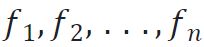 where 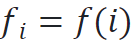and share them with corresponding participants, where `i` is the index of different participants of `Share`
3. Accept all 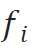 from other participants as 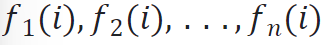, where `i` is the index of receiver, and compute 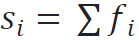 to get the final secret key.

#### **Generating the Global Public Key**

The global public key is generated using Publicly Verifiable Secret Sharing (PVSS):

1. Each participant uploads 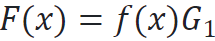 within his PVSS to the [KeyManagement contract](../../governance/neo-x-system-contracts.md#keymanagement).
2. The contract verifies each PVSS and computes: 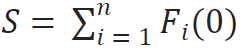 as the global public key.

A well-constructed PVSS includes:

* 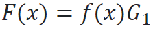 as the sender’s local secret commitment.
* 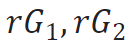 as a pair of commitments for a random scalar `r`.
* 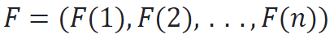 as the commitment share messages.

The KeyManagement contract validates  F(1), F(2), ..., F(n) , and verifies scalar `r`. Recipients validate their received shares using: 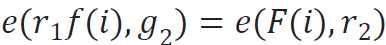


**Future Enhancement:** Zero-Knowledge Proofs (ZKPs) will be integrated to enhance encryption verification.


#### **Reshare Phase**

Each participant executes the following steps:

1.  Regenerate his local secret while preserving the constant term 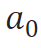&#x20;

    $$
    f'(x)=a_0+a'_1 x+a'2 x^2+⋯a'{t-1}x^{t-1}
    $$
2. Follow the step 2 and 3 in the **Share** phase, but send the shares to the next consensus group.

The KeyManagement contract ensures F(0) = F'(0), preserving the global public key unchanged and preventing leakage of the original secret shares.

#### **Recover Phase (Optional)**

If some secret shares are lost, the remaining consensus members help restore them:

1. The current consensus group forwards all received shares  f\_i  from the lost index `i` to its successor.
2. The recipient reconstructs the original local secrets using [**Lagrange interpolation**](https://en.wikipedia.org/wiki/Lagrange_polynomial).

> **Security Note**: `Recover` exposes at most `f` of the original secrets, so it is only allowed when the index `i` is confirmed absent from `Reshare`.

## Threshold Public Key Encryption (TPKE)

Neo X's DKG enables a **Threshold Public Key Encryption (TPKE)** scheme, ensuring that encrypted transactions can only be decrypted if at least **2f+1** consensus nodes cooperate. This mechanism is crucial for preventing premature exposure of transaction details.

### Encryption Process

1. A transaction payload is encrypted using an ephemeral AES key.
2. The AES key is encrypted using the threshold public key and embedded into the transaction.
3. The encrypted transaction (Envelope) is submitted to the network.

### Decryption Process

1. During block finalization, consensus nodes collectively contribute decryption shares.
2. Once at least **2f+1** shares are available, the transaction payload is decrypted and executed.
3. This ensures transactions remain confidential until they are irreversibly ordered in the block.
